# codex-auto-pilot

Turn one approved software goal, plan, or design spec into a production-ready pull request, then promote that exact candidate in a separately authorized release session.

```text
$auto-pilot pr docs/approved-plan.md
$auto-pilot ship docs/approved-plan.md
$auto-pilot release https://github.com/owner/repo/pull/123
```

Auto Pilot v0.9.0 minimizes contexts without weakening the final review or production boundary. Tiny work stays with the controller. By default, substantive PR work uses one fresh, user-visible independent Codex task in an isolated worktree, then returns one compact handoff to the controller. The built-in preference is `gpt-5.6-terra` with `ultra` thinking for that task; a generated release task prefers `gpt-5.6-sol` with `xhigh`. Those are configurable preferences, not delivery evidence or authority.

## What it does

1. Treats a complete approved artifact as the PR-stage implementation input.
2. Routes tiny work directly and substantive implementation to one declared accountable lane.
3. Returns once to the controller for one consolidated review, direct fixes, exact-candidate verification, and PR creation.
4. Stops at an open, unmerged `pr_ready` result with no production mutation.
5. Promotes only through a fresh release task—started manually with `release`, or automatically after `pr_ready` when the current command explicitly selects `ship`.

An independent Codex task is not a collaboration subagent. Collaboration subagents are optional, bounded helpers with isolated ownership; they never silently replace the primary task or become the release owner. Auto Pilot does **not** create planning, preparation, inventory, status, log-summary, reviewer, or repair agents. Mechanical inventory and verification belong in deterministic repository scripts or bounded tool calls.

## Execution topology

There are at most three primary contexts across a complete PR-to-production lifecycle. Tiny PRs use only the controller. Substantive PRs add one accountable implementation lane. A release controller starts either from a later manual `release` command or automatically after a current `ship` command reaches `pr_ready`.

```mermaid
flowchart TB
    START["User<br/>$auto-pilot pr or ship approved-plan.md"] --> P1

    subgraph S1["PR controller"]
        direction TB
        P1["P1. Read approved plan<br/>Acquire PR-stage authority"]
        P2["P2. Minimal repository truth refresh<br/>Bind base SHA, scope, and rules"]
        P3{"P3. Tiny or substantive?"}
        P4["P4A. Tiny change<br/>Controller implements directly"]
        P5["P4B. Dispatch declared<br/>implementation lane"]
        P6["P5. Resume and validate handoff<br/>Branch, head SHA, and checks"]
        P7["P6. One consolidated review<br/>Correctness, architecture, and security"]
        P8["P7. Controller patches all findings directly"]
        P9["P8. Exact-candidate verification"]
        P10["P9. Commit, push, and open PR"]
        P11["P10. Validate final pr_ready receipt<br/>with continuation outcome"]

        P1 --> P2 --> P3
        P3 -->|"Tiny"| P4 --> P7
        P3 -->|"Substantive"| P5
        P6 --> P7 --> P8 --> P9 --> P10
    end

    subgraph S2["Fresh independent implementation task (default substantive lane)"]
        direction TB
        T1["T1. Create isolated worktree<br/>Bind the supplied base SHA"]
        T2["T2. Read the approved plan and owned scope"]
        T3["T3. Implement the complete approved scope"]
        T4["T4. Run focused checks and causal fixes"]
        T5["T5. Commit and push the task branch"]
        T6["T6. Return one compact handoff<br/>Session 2 ends"]

        T1 --> T2 --> T3 --> T4 --> T5 --> T6
    end

    P5 -->|"Plan + base SHA<br/>scope + required checks"| T1
    T6 -->|"Branch + head SHA<br/>changed paths + checks + risks"| P6
    P10 --> CONTINUE{"Release continuation authorized?"}
    CONTINUE -->|"No: pr"| P11
    CONTINUE -->|"Yes: ship"| DISPATCH["Create one fresh task or reuse<br/>the exact release task for this PR head"]
    DISPATCH --> P11
    P11 --> READY["Open, unmerged PR<br/>PR controller ends"]
    READY -.->|"Optional later command"| MANUAL["User<br/>$auto-pilot release PR-URL"]

    subgraph S3["Fresh release task"]
        direction TB
        R1["R1. Acquire fresh release authority"]
        R2["R2. Read live PR state<br/>Never rely on Session 1 conversation"]
        R3["R3. Bind base/head SHA<br/>checks, reviews, and mergeability"]
        R4["R4. Compatibility proof and dry-run<br/>Reuse only hash-matched evidence"]
        R5["R5. Protected merge"]
        R6["R6. Run repository migration/deploy harness"]
        R7["R7. Verify real production"]
        R8["R8. Validate released/merged/blocked receipt<br/>Session 3 ends"]

        R1 --> R2 --> R3 --> R4 --> R5 --> R6 --> R7 --> R8
    end

    DISPATCH --> R1
    MANUAL --> R1
```



| Work | PR controller | Implementation lane | Release task |
|---|---:|---:|---:|
| Tiny PR | Required | Not created | Not created |
| Substantive PR (default) | Required | One independent task, isolated worktree | Not created |
| One-command `ship` | Required | Only if substantive | One fresh task after `pr_ready`, unless exact continuation exists |
| Later manual promotion | Already ended | Already ended | Required |

The controller-to-implementer input contains the approved plan, base SHA, owned scope, and required checks. The only return handoff contains Git identities, changed paths, check evidence, risks, and blockers—not copied conversation history or hidden reasoning. `ship` does not carry the PR conversation into release: it creates one fresh task for a PR head, or reuses the exact existing continuation task for that same head.

## Install

### Codex plugin

```bash
codex plugin marketplace add tombelieber/tomstack
codex plugin add codex-auto-pilot@tomstack
```

### CLI installer

```bash
npx github:tombelieber/codex-auto-pilot install
```

Or:

```bash
curl -fsSL https://raw.githubusercontent.com/tombelieber/codex-auto-pilot/main/install.sh | sh
```

Preview or verify an installation:

```bash
npx github:tombelieber/codex-auto-pilot install --dry-run
npx github:tombelieber/codex-auto-pilot doctor
```

Use `install --force` only to replace an existing Auto Pilot skill; the installer backs up replaced content first. The default installer copies only the skill. It does not install custom agent profiles, change Codex concurrency, or edit `.codex/config.toml`.

To enable automatic local run history for a standalone skill installation:

```bash
npx github:tombelieber/codex-auto-pilot install --with-local-history
```

This adds four passive user-level Codex lifecycle hooks without changing model context. Existing hook definitions are preserved and backed up before modification. Review and trust newly installed hooks once with `/hooks`.

## Configuration

Preferences resolve in this order: current invocation flags, optional user configuration, then built-in defaults. The optional JSON file is `~/.codex-auto-pilot/config.json`; set `CODEX_AUTO_PILOT_CONFIG` to another absolute path. It is read only.

```json
{
  "implementation": {"substantive_executor": "task", "model": "gpt-5.6-terra", "thinking": "ultra"},
  "release": {"model": "gpt-5.6-sol", "thinking": "xhigh"},
  "collaboration": {"policy": "auto"}
}
```

Invocation overrides are `--implementation-executor`, `--implementation-model`, `--implementation-thinking`, `--release-model`, `--release-thinking`, and `--collaboration`. See the full [configuration reference](skills/auto-pilot/references/configuration.md).

`task` is the default substantive executor. `direct`, `subagent`, and `auto` are explicit routing choices; a primary collaboration subagent must be declared, requires collaboration not to be `off`, and is never presented as an independent task. If a user-visible task interface is unavailable, the controller may implement directly and records that disclosed fallback. If a fresh release task interface is unavailable, the PR controller stops at `pr_ready` and returns the exact `$auto-pilot release <PR URL>` command; it never releases in place.

## Delivery modes

PR mode is the default, but the explicit form is preferred:

```text
$auto-pilot pr docs/approved-plan.md
```

It stops with an open, unmerged, production-ready PR and no production mutation.

Ship mode is the one-command PR-to-production lane:

```text
$auto-pilot ship docs/approved-plan.md
```

An equally clear current instruction such as “finish this and release it” may be normalized to `ship`. Auto Pilot still completes the PR stage first. Once the PR is ready, it creates one fresh release task for that PR head, or reuses its exact existing continuation, then ends the PR controller. Questions, hypotheticals, future wishes, quoted examples, prior-chat intent, and negated release requests never select this mode.

Release mode requires a new explicit invocation that identifies an existing PR:

```text
$auto-pilot release https://github.com/owner/repo/pull/123
```

It starts from the live candidate, merges through the repository's normal protected path, uses the discovered release mechanism, handles approved migrations or backfills, and verifies each affected capability through its exact production actor, credential, scope, runtime principal, representative data, and terminal outcome. It then publishes canonical release notes and ends every `released` response with a compact release message linked to them. Live canaries are release-only and impact-selected; they are never run on every edit or commit. If the repository has no release mechanism, it stops after merging. A PR-stage conversation or receipt is evidence, never release authority.

Each session reports one terminal state: the PR controller reports `pr_ready` or `blocked`; the fresh release controller reports `merged_main`, `released`, or `blocked`. Its completion receipt records plan, Git, criteria, checks, PR/release evidence, exact release capability reachability, and blockers without copying model reasoning. A successful deployment with missing reachability proof remains `blocked`, not `released`.

After a successful merge or release, Auto Pilot automatically closes the
task-owned local workspace: it verifies the worktree is clean, unlocked,
merged, pushed, and reachable from the remote base; removes it with Git from
outside the target directory; prunes stale metadata; and safe-deletes the task
branch. Remote-branch deletion remains subject to repository policy. It never
force-removes a worktree; an unsafe or failed cleanup makes the run `blocked`.

## Local run history

The plugin bundles an optional, local-only collector. After its hooks are trusted, every leading execution-form `$auto-pilot` invocation is captured automatically; inline discussions and optimization questions are ignored. Manifests distinguish PR-only, automatic release continuation, and direct release runs:

1. `UserPromptSubmit` records the invocation and baseline token totals.
2. `SubagentStop` archives each subagent transcript when one exists.
3. `Stop` archives the root transcript and computes deterministic run metrics.
4. `SessionEnd` recovers a run that ended without a normal turn stop.

Collection uses local Node.js scripts and returns empty hook context. It does not call a model, add orchestration, or upload data. Raw transcripts default to 90-day retention while manifests and aggregate metrics remain available. A private routing audit records passed, fallback, deviation, or unknown separately from the receipt-backed delivery outcome; it does not make a delivery receipt pass or fail.

```bash
codex-auto-pilot history status
codex-auto-pilot history list --since 30d
codex-auto-pilot history report --since 30d
codex-auto-pilot history retention 30
codex-auto-pilot history retention forever
```

The archive lives at `~/.codex-auto-pilot/history` by default. Override it with `CODEX_AUTO_PILOT_DATA`. See the [history schema](skills/auto-pilot/references/history-schema.md) and the [OSS observability research](https://github.com/tombelieber/codex-auto-pilot/blob/main/docs/research/oss-agent-eval-observability.md).

## Is this topology optimal?

It is the current **structurally optimized candidate**, not a universal or statistically proven optimum. It minimizes handoffs subject to three non-negotiable constraints: an independent substantive implementation context by default, one final reviewer/fixer, and a fresh production-authority boundary. Automatic `ship` removes a user round trip without merging the PR and release contexts.

Verify it from receipt-backed local history rather than intuition:

1. Compare only runs with a valid completion receipt and an identical complete skill-bundle hash.
2. Cohort comparable work by mode, tiny/substantive route, repository, risk class, and required quality gates.
3. Measure total lifecycle tokens, uncached input, elapsed time, tool calls, compactions, handoff count, repair work, blocked rate, and terminal quality evidence.
4. Reject a cheaper topology if it increases escaped defects, incomplete scope, repeated repair loops, or unsafe release outcomes.
5. Promote a routing change only after several comparable successful runs show a repeatable improvement; never infer causality from one unusually small task.

The collector's benchmark cohort excludes legacy or unverified outcomes. Independent user-visible implementation sessions are not automatically attributable to the parent PR run in every Codex runtime, so a root-only token total must not be presented as the complete cost of a substantive PR. Use explicit linked session evidence before making that comparison.

## Privacy and safety

- No remote telemetry is collected.
- Local run history is enabled only by trusting the plugin hooks or using `install --with-local-history`.
- Full transcripts may contain prompts, source code, tool output, credentials, personal data, and private paths. The archive is private local data and must never be committed or uploaded without review and redaction.
- No plan, code, or repository data is uploaded by this project.
- No credentials are bundled; normal local and repository authentication applies.
- The public GitHub handle `tombelieber` is intentionally present.

`npm run check` scans the distributable tree and Git history for common credentials, private home paths, non-noreply email addresses, environment files, private keys, and symlinks.

## Limits

- The supplied artifact must already contain the product decisions and acceptance criteria needed for implementation.
- Repository instructions, deterministic checks, branch protection, and production safety still apply.
- Auto Pilot does not invent a deployment, migration, backfill, or rollback mechanism when the repository has none.
- Model and tool availability depend on the active Codex runtime.
- Automatic `ship` requires the runtime to create a separate task. If unavailable, Auto Pilot returns the exact manual `release` command and never falls back to same-session production mutation.
- Codex transcript JSONL is not a stable public schema. The collector preserves the original file and versions its derived metrics so future parsers can reprocess the evidence.

## Contributing and security

See [CONTRIBUTING.md](CONTRIBUTING.md) and [SECURITY.md](SECURITY.md).

## License

[MIT](LICENSE) © tombelieber
