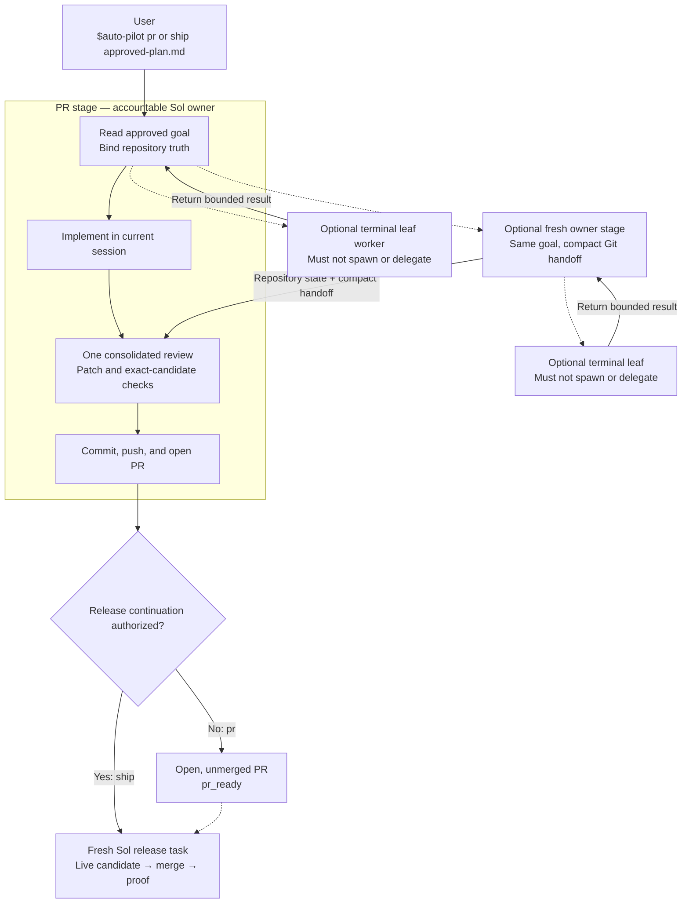

# codex-auto-pilot

Turn one approved software goal, plan, or design spec into a production-ready pull request, then promote that exact candidate in a separately authorized release session.

```text
$auto-pilot pr docs/approved-plan.md
$auto-pilot ship docs/approved-plan.md
$auto-pilot release https://github.com/owner/repo/pull/123
```

Auto Pilot v0.11.0 keeps one accountable Sol owner in control without forcing an agent team or fresh implementation task. The owner may finish the goal in its current session, or independently choose fresh owner stages and leaf workers when context separation or parallelism materially helps. Reference preferences are `gpt-5.6-sol` with `xhigh` thinking for owner stages and `gpt-5.6-luna` with `max` for optional leaves. These are configurable examples, not delivery evidence or authority.

## What it does

1. Treats a complete approved artifact as the PR-stage implementation input.
2. Lets the accountable owner choose direct execution or optional fresh stages; `tiny` and `substantive` remain advisory metadata only.
3. Allows optional leaf workers without recommending them, then returns their results to the owner for one consolidated review, direct fixes, exact-candidate verification, and PR creation.
4. Stops at an open, unmerged `pr_ready` result with no production mutation.
5. Promotes only through a fresh release task—started manually with `release`, or automatically after `pr_ready` when the current command explicitly selects `ship`.

An independent Codex task is not a collaboration subagent. Auto Pilot does not prescribe agent teams, worker counts, or wave cadence. If an owner independently chooses collaboration, every helper is a terminal leaf that must not spawn, fork, create another task, or delegate. A fresh stage owner may itself be a child task and may still choose its own leaves. Mechanical inventory and verification belong in deterministic repository scripts or bounded tool calls.

## Execution topology

The normal path is one accountable Sol owner completing the PR stage in its
current session. Context separation is an owner-selected scaling pattern, not a
mandatory classifier result. Native compaction stays inside the same session;
creating a new session creates a new owner stage.



| Execution shape | When used | Ownership |
|---|---|---|
| Direct | Owner can reliably finish in the current context | Current Sol owner |
| Fresh owner stage | Owner judges clean context separation useful | New Sol owner stage |
| Leaf worker | Any owner independently judges a bounded packet useful | Terminal leaf; no delegation |
| Release task | Explicit `ship` or later `release` authority | Fresh Sol release owner |

Fresh-stage handoffs contain the approved goal, Git identities, completed and
remaining outcomes, changed paths, check evidence, risks, and blockers—not
copied conversation history or hidden reasoning. A continuation stage is a new
owner stage, not a failure. `ship` likewise does not carry the PR conversation
into release: it creates one fresh task for a PR head, or reuses the exact
existing continuation task for that same head.

## Install

### Codex plugin

```bash
codex plugin marketplace add tombelieber/tomstack
codex plugin add codex-auto-pilot@tomstack
```

### CLI installer

```bash
npx github:tombelieber/codex-auto-pilot install
```

Or:

```bash
curl -fsSL https://raw.githubusercontent.com/tombelieber/codex-auto-pilot/main/install.sh | sh
```

Preview or verify an installation:

```bash
npx github:tombelieber/codex-auto-pilot install --dry-run
npx github:tombelieber/codex-auto-pilot doctor
```

Use `install --force` only to replace an existing Auto Pilot skill; the installer backs up replaced content first. The default installer copies only the skill. It does not install custom agent profiles, change Codex concurrency, or edit `.codex/config.toml`.

To enable automatic local run history for a standalone skill installation:

```bash
npx github:tombelieber/codex-auto-pilot install --with-local-history
```

This adds four passive user-level Codex lifecycle hooks without changing model context. Existing hook definitions are preserved and backed up before modification. Review and trust newly installed hooks once with `/hooks`.

## Configuration

Preferences resolve in this order: current invocation flags, optional user configuration, then built-in defaults. The optional JSON file is `~/.codex-auto-pilot/config.json`; set `CODEX_AUTO_PILOT_CONFIG` to another absolute path. It is read only.

```json
{
  "implementation": {"substantive_executor": "auto", "model": "gpt-5.6-sol", "thinking": "xhigh"},
  "release": {"model": "gpt-5.6-sol", "thinking": "xhigh"},
  "collaboration": {"policy": "auto", "model": "gpt-5.6-luna", "thinking": "max"}
}
```

Invocation overrides are `--implementation-executor`, `--implementation-model`, `--implementation-thinking`, `--release-model`, `--release-thinking`, `--collaboration`, `--collaboration-model`, and `--collaboration-thinking`. See the full [configuration reference](skills/auto-pilot/references/configuration.md).

`auto` leaves execution-shape selection with the accountable owner; it does not actively recommend a task or agent team. `task`, `direct`, and `subagent` remain explicit overrides. Collaboration `auto` only makes leaf workers available if an owner independently chooses them. Every leaf is terminal and may not delegate. If a fresh release task interface is unavailable, the PR owner stops at `pr_ready` and returns the exact `$auto-pilot release <PR URL>` command; it never releases in place.

## Delivery modes

PR mode is the default, but the explicit form is preferred:

```text
$auto-pilot pr docs/approved-plan.md
```

It stops with an open, unmerged, production-ready PR and no production mutation.

Ship mode is the one-command PR-to-production lane:

```text
$auto-pilot ship docs/approved-plan.md
```

An equally clear current instruction such as “finish this and release it” may be normalized to `ship`. Auto Pilot still completes the PR stage first. Once the PR is ready, it creates one fresh release task for that PR head, or reuses its exact existing continuation, then ends the PR controller. Questions, hypotheticals, future wishes, quoted examples, prior-chat intent, and negated release requests never select this mode.

Release mode requires a new explicit invocation that identifies an existing PR:

```text
$auto-pilot release https://github.com/owner/repo/pull/123
```

It starts from the live candidate, merges through the repository's normal protected path, uses the discovered release mechanism, handles approved migrations or backfills, and verifies each affected capability through its exact production actor, credential, scope, runtime principal, representative data, and terminal outcome. It then publishes canonical release notes and ends every `released` response with a compact release message linked to them. Live canaries are release-only and impact-selected; they are never run on every edit or commit. If the repository has no release mechanism, it stops after merging. A PR-stage conversation or receipt is evidence, never release authority.

Each session reports one terminal state: the PR controller reports `pr_ready` or `blocked`; the fresh release controller reports `merged_main`, `released`, or `blocked`. Its completion receipt records plan, Git, criteria, checks, PR/release evidence, exact release capability reachability, and blockers without copying model reasoning. A successful deployment with missing reachability proof remains `blocked`, not `released`.

After a successful merge or release, Auto Pilot automatically closes the
task-owned local workspace: it verifies the worktree is clean, unlocked,
merged, pushed, and reachable from the remote base; removes it with Git from
outside the target directory; prunes stale metadata; and safe-deletes the task
branch. Remote-branch deletion remains subject to repository policy. It never
force-removes a worktree; an unsafe or failed cleanup makes the run `blocked`.

## Local run history

The plugin bundles an optional, local-only collector. After its hooks are trusted, every leading execution-form `$auto-pilot` invocation is captured automatically; inline discussions and optimization questions are ignored. Hooks now write only thin lifecycle bookmarks:

1. `UserPromptSubmit` records the invocation boundary, source offset, and exact skill/config identity.
2. `SubagentStop` records the agent identity and source path/size without copying or parsing it.
3. `Stop` records the terminal boundary, final-message hash, and a small receipt-source snapshot when present.
4. `SessionEnd` records a recovery boundary for an unfinished invocation.

Heavy transcript parsing, hashing, token accounting, topology reconstruction, routing audit, and receipt validation run post-hoc with `history materialize`; `list`, `goals`, and `report` materialize pending runs automatically. The original Codex JSONL stays canonical and is not duplicated for new runs. Collection returns empty hook context, calls no model, adds no orchestration, and uploads nothing. Missing or changed source evidence stays unknown instead of becoming a false zero.

```bash
codex-auto-pilot history status
codex-auto-pilot history materialize
codex-auto-pilot history list --since 30d
codex-auto-pilot history goals --since 30d
codex-auto-pilot history report --since 30d
codex-auto-pilot history retention 30
codex-auto-pilot history retention forever
```

The archive lives at `~/.codex-auto-pilot/history` by default. Override it with `CODEX_AUTO_PILOT_DATA`. See the [history schema](skills/auto-pilot/references/history-schema.md), the [OSS observability research](https://github.com/tombelieber/codex-auto-pilot/blob/main/docs/research/oss-agent-eval-observability.md), and the [Tokscale parser audit](https://github.com/tombelieber/codex-auto-pilot/blob/main/docs/research/tokscale-session-analysis.md).

## Is this topology optimal?

It is the current **owner-decided reference topology**, not a universal or statistically proven optimum. It preserves three non-negotiable constraints: one accountable owner for each active stage, terminal leaf workers that never delegate, and a fresh production-authority boundary. It does not force context separation merely because scope metadata says `substantive`. Automatic `ship` removes a user round trip without merging the PR and release contexts.

Verify it from receipt-backed local history rather than intuition:

1. Compare only runs with a valid completion receipt and an identical complete skill-bundle hash.
2. Cohort comparable work by mode, advisory scope hint, actual execution shape, repository, risk class, and required quality gates.
3. Measure total lifecycle tokens, uncached input, elapsed time, tool calls, compactions, handoff count, repair work, blocked rate, and terminal quality evidence.
4. Reject a cheaper topology if it increases escaped defects, incomplete scope, repeated repair loops, or unsafe release outcomes.
5. Promote a routing change only after several comparable successful runs show a repeatable improvement; never infer causality from one unusually small task.

The collector's benchmark cohort excludes legacy or unverified outcomes. Fresh user-visible owner stages are grouped only when the dispatching routing marker and receiving invocation share the same opaque goal ID. Collaboration-agent tokens remain separate and unverified in schema v4 because child JSONL may replay parent history; those runs stay outside token-cost cohorts until semantic replay deduplication is proven.

## Privacy and safety

- No remote telemetry is collected.
- Local run history is enabled only by trusting the plugin hooks or using `install --with-local-history`.
- Referenced local transcripts may contain prompts, source code, tool output, credentials, personal data, and private paths. New history runs do not duplicate them, but both the Codex session store and the private marker archive must never be committed or uploaded without review and redaction.
- No plan, code, or repository data is uploaded by this project.
- No credentials are bundled; normal local and repository authentication applies.
- The public GitHub handle `tombelieber` is intentionally present.

`npm run check` scans the distributable tree and Git history for common credentials, private home paths, non-noreply email addresses, environment files, private keys, and symlinks.

## Limits

- The supplied artifact must already contain the product decisions and acceptance criteria needed for implementation.
- Repository instructions, deterministic checks, branch protection, and production safety still apply.
- Auto Pilot does not invent a deployment, migration, backfill, or rollback mechanism when the repository has none.
- Model and tool availability depend on the active Codex runtime.
- Automatic `ship` requires the runtime to create a separate task. If unavailable, Auto Pilot returns the exact manual `release` command and never falls back to same-session production mutation.
- Codex transcript JSONL is not a stable public schema. The collector references the original local file and independently versions marker, parser, and materializer schemas so available evidence can be rebuilt.

## Contributing and security

See [CONTRIBUTING.md](CONTRIBUTING.md) and [SECURITY.md](SECURITY.md).

## License

[MIT](LICENSE) © tombelieber
