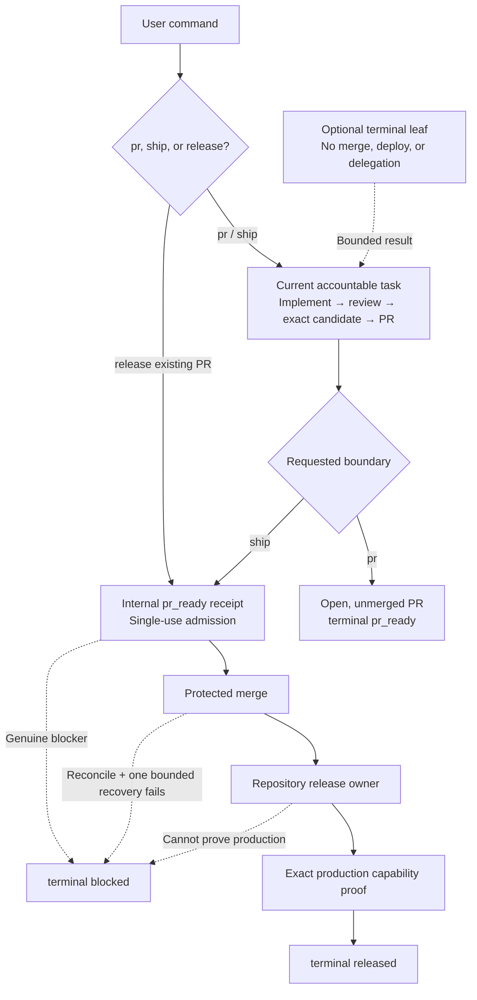

# codex-auto-pilot

> [!IMPORTANT]
> **The maintained `auto-pilot` skill now lives in
> [Tomstack](https://github.com/tombelieber/tomstack/tree/main/skills/engineering/auto-pilot).**
> Install and update the reusable skill from Tomstack. This repository remains
> the supported home of the Codex plugin, CLI, hooks, run history, and releases.

Turn one approved software goal, plan, or design spec into either a verified pull request or a production release at the boundary named by the command.

```text
$auto-pilot pr docs/approved-plan.md
$auto-pilot ship docs/approved-plan.md
$auto-pilot release https://github.com/owner/repo/pull/123
```

Auto Pilot v0.12.0 keeps one accountable Sol owner in control without forcing an agent team. `pr` ends at a verified open PR. `ship` keeps that same accountable task through implementation, PR, merge, deployment or distribution, and production proof. Direct `release` promotes an existing PR in the current task. Reference preferences are `gpt-5.6-sol` with `xhigh` thinking for owners and `gpt-5.6-luna` with `max` for optional terminal leaves; these are configurable examples, not delivery evidence or authority.

## What it does

1. Treats a complete approved artifact as the implementation input and discovers the real release path early for `ship`.
2. Keeps one accountable owner in the invoking task; optional helpers are terminal leaves and never own merge or production.
3. Consolidates implementation, review, direct fixes, exact-candidate verification, and PR creation once.
4. Ends `pr` at open, unmerged `pr_ready`; for `ship`, that receipt is only an internal admission handoff.
5. Ends `ship` and `release` only as production-proven `released` or honestly `blocked`—never at PR readiness or merge-only.

An independent Codex task is not a collaboration subagent. Auto Pilot does not prescribe agent teams, worker counts, or wave cadence. If an owner independently chooses collaboration, every helper is a terminal leaf that must not spawn, fork, create another task, delegate, merge, deploy, migrate, roll back, or own production. Mechanical inventory and verification belong in deterministic repository scripts or bounded tool calls.

## Execution topology

The normal path is one accountable Sol owner completing the command in its
current task. Native compaction stays inside that task. Optional collaboration
may help with bounded implementation packets, but responsibility never leaves
the invoking owner.



| Execution shape | When used | Ownership |
|---|---|---|
| Direct | Owner can reliably finish in the current context | Current Sol owner |
| Leaf worker | Any owner independently judges a bounded packet useful | Terminal leaf; no delegation |
| `pr` boundary | User requests a verified unmerged PR | Current Sol owner ends at `pr_ready` |
| `ship` boundary | User requests implementation through production | Same Sol owner ends at `released` or `blocked` |
| Direct `release` | User requests promotion of an existing PR | Current Sol owner ends at `released` or `blocked` |

Helper handoffs contain the approved goal, Git identities, bounded outcomes,
changed paths, check evidence, risks, and blockers—not copied conversation
history or hidden reasoning. A `ship` internal receipt binds the qualified PR
head to the same accountable task; it is not a user-visible continuation. A
terminal `released` or `blocked` release attempt is sealed and never resumed.

## Install

### Maintained skill only (Codex, Claude Code, and other agents)

```bash
npx skills@latest add tombelieber/tomstack --skill=auto-pilot
```

This is the canonical reusable skill. Use the standalone plugin below when you
also need Codex hooks, local run history, and the packaged CLI.

### Codex plugin

```bash
codex plugin marketplace add tombelieber/tomstack
codex plugin add codex-auto-pilot@tomstack
```

### CLI installer

```bash
npx github:tombelieber/codex-auto-pilot install
```

Or:

```bash
curl -fsSL https://raw.githubusercontent.com/tombelieber/codex-auto-pilot/main/install.sh | sh
```

Preview or verify an installation:

```bash
npx github:tombelieber/codex-auto-pilot install --dry-run
npx github:tombelieber/codex-auto-pilot doctor
```

Use `install --force` only to replace an existing Auto Pilot skill; the installer backs up replaced content first. The default installer copies only the skill. It does not install custom agent profiles, change Codex concurrency, or edit `.codex/config.toml`.

To enable automatic local run history for a standalone skill installation:

```bash
npx github:tombelieber/codex-auto-pilot install --with-local-history
```

This adds four passive user-level Codex lifecycle hooks without changing model context. Existing hook definitions are preserved and backed up before modification. Review and trust newly installed hooks once with `/hooks`.

## Configuration

Preferences resolve in this order: current invocation flags, optional user configuration, then built-in defaults. The optional JSON file is `~/.codex-auto-pilot/config.json`; set `CODEX_AUTO_PILOT_CONFIG` to another absolute path. It is read only.

```json
{
  "implementation": {"substantive_executor": "auto", "model": "gpt-5.6-sol", "thinking": "xhigh"},
  "release": {"model": "gpt-5.6-sol", "thinking": "xhigh"},
  "collaboration": {"policy": "auto", "model": "gpt-5.6-luna", "thinking": "max"}
}
```

Invocation overrides are `--implementation-executor`, `--implementation-model`, `--implementation-thinking`, `--release-model`, `--release-thinking`, `--collaboration`, `--collaboration-model`, and `--collaboration-thinking`. See the full [configuration reference](skills/auto-pilot/references/configuration.md).

`auto` leaves execution-shape selection with the accountable owner; it does not actively recommend an agent team. `task`, `direct`, and `subagent` remain implementation preferences, but they cannot transfer the terminal promise of `ship`. Collaboration `auto` only makes leaf workers available if the owner independently chooses them. Every leaf is terminal and may not delegate or own merge, deploy, migration, rollback, or production. Release model preferences never create a release handoff.

## Delivery modes

PR mode is the default, but the explicit form is preferred:

```text
$auto-pilot pr docs/approved-plan.md
```

It stops with an open, unmerged, production-ready PR and no production mutation. Its only successful terminal state is `pr_ready`.

Ship mode is the one-command PR-to-production lane:

```text
$auto-pilot ship docs/approved-plan.md
```

An equally clear current instruction such as “finish this and release it” may be normalized to `ship`. Auto Pilot discovers and preflights the real production or public-distribution path before merge, completes the PR stage, and stores the validated `pr_ready` receipt as an internal single-use admission input. The same accountable task binds the live base and head plus source-receipt and installed-contract SHA-256 values, merges through the normal protected path, runs the repository release owner, waits for rollout, and proves the exact production capability. Questions, hypotheticals, future wishes, quoted examples, prior-chat intent, and negated release requests never select this mode.

Release mode requires an explicit current invocation that identifies an existing PR:

```text
$auto-pilot release https://github.com/owner/repo/pull/123
```

It starts from the live candidate and validates one bounded admission packet before merge. If no valid prior `pr_ready` receipt is available, the current task builds a fresh read-only receipt from the live exact candidate; a missing artifact from another task is not itself a blocker. Release mode treats the candidate as immutable: it cannot edit source, create a commit or branch, open another PR, or repair CI or release tooling. It imposes no arbitrary whole-task timer: CI, deploy, and observation are awaited with bounded status reads or the product wait mechanism. It merges through the repository's normal protected path, uses the discovered release mechanism, handles approved migrations or backfills, and verifies each affected capability through its exact production actor, credential, scope, runtime principal, representative data, artifact, and terminal outcome. Live canaries are release-only and impact-selected; they are never run on every edit or commit. If no production or distribution path exists, it blocks before merge.

`pr` reports `pr_ready` or `blocked`. `ship` and `release` report only `released` or `blocked`; an open PR, merge, deploy start, and successful deploy without production proof are not success. Any terminal release result permanently seals that attempt against later production mutation. Its schema-v8 completion receipt records plan, Git, exact candidate, PR/release evidence, contract/source bindings, exact capability reachability, and structured blockers without copying model reasoning.

After a release, Auto Pilot attempts to close the task-owned local workspace:
it verifies clean, unlocked, merged, pushed, and reachable state; removes it
with Git from outside the target directory; prunes stale metadata; and safely
deletes task branches when policy permits. It never force-removes a worktree.
Release-note or local-cleanup failure remains a visible closeout warning; it
cannot rewrite an already production-proven release as `blocked`.

## Local run history

The plugin bundles an optional, local-only collector. After its hooks are trusted, every leading execution-form `$auto-pilot` invocation is captured automatically; inline discussions and optimization questions are ignored. Hooks now write only thin lifecycle bookmarks:

1. `UserPromptSubmit` records the invocation boundary, source offset, and exact skill/config identity.
2. `SubagentStop` records the agent identity and source path/size without copying or parsing it.
3. `Stop` records the terminal boundary, final-message hash, and a small receipt-source snapshot when present.
4. `SessionEnd` records a recovery boundary for an unfinished invocation.

Heavy transcript parsing, hashing, token accounting, topology reconstruction, routing audit, and receipt validation run post-hoc with `history materialize`; `list`, `goals`, and `report` materialize pending runs automatically. The original Codex JSONL stays canonical and is not duplicated for new runs. Collection returns empty hook context, calls no model, adds no orchestration, and uploads nothing. Missing or changed source evidence stays unknown instead of becoming a false zero.

```bash
codex-auto-pilot history status
codex-auto-pilot history materialize
codex-auto-pilot history list --since 30d
codex-auto-pilot history goals --since 30d
codex-auto-pilot history report --since 30d
codex-auto-pilot history retention 30
codex-auto-pilot history retention forever
```

The archive lives at `~/.codex-auto-pilot/history` by default. Override it with `CODEX_AUTO_PILOT_DATA`. See the [history schema](skills/auto-pilot/references/history-schema.md), the [OSS observability research](https://github.com/tombelieber/codex-auto-pilot/blob/main/docs/research/oss-agent-eval-observability.md), and the [Tokscale parser audit](https://github.com/tombelieber/codex-auto-pilot/blob/main/docs/research/tokscale-session-analysis.md).

## Is this topology optimal?

It is the current **owner-decided reference topology**, not a universal or statistically proven optimum. It preserves three non-negotiable constraints: one accountable owner for the requested terminal outcome, terminal leaf workers that never delegate or own production, and an immutable single-use admission boundary before mutation. It does not force collaboration merely because scope metadata says `substantive`. `ship` removes both the user round trip and the ownership gap while retaining a deterministic PR-to-release contract boundary.

Verify it from receipt-backed local history rather than intuition:

1. Compare only runs with a valid completion receipt and an identical complete skill-bundle hash.
2. Cohort comparable work by mode, advisory scope hint, actual execution shape, repository, risk class, and required quality gates.
3. Measure total lifecycle tokens, uncached input, elapsed time, tool calls, compactions, handoff count, repair work, blocked rate, and terminal quality evidence.
4. Reject a cheaper topology if it increases escaped defects, incomplete scope, repeated repair loops, or unsafe release outcomes.
5. Promote a routing change only after several comparable successful runs show a repeatable improvement; never infer causality from one unusually small task.

The collector exposes a receipt-valid delivery cohort and a stricter benchmark cohort that additionally requires passed same-task routing plus one exact skill-bundle hash. It reports bundle cohorts separately and marks cross-bundle results incomparable. Fresh PR-only owner stages are grouped only when the dispatching routing marker and receiving invocation share the same opaque goal ID. Collaboration-agent tokens remain separate and unverified because child JSONL may replay parent history; those runs stay outside token-cost cohorts until semantic replay deduplication is proven.

## Privacy and safety

- No remote telemetry is collected.
- Local run history is enabled only by trusting the plugin hooks or using `install --with-local-history`.
- Referenced local transcripts may contain prompts, source code, tool output, credentials, personal data, and private paths. New history runs do not duplicate them, but both the Codex session store and the private marker archive must never be committed or uploaded without review and redaction.
- No plan, code, or repository data is uploaded by this project.
- No credentials are bundled; normal local and repository authentication applies.
- The public GitHub handle `tombelieber` is intentionally present.

`npm run check` scans the distributable tree and Git history for common credentials, private home paths, non-noreply email addresses, environment files, private keys, and symlinks.

## Limits

- The supplied artifact must already contain the product decisions and acceptance criteria needed for implementation.
- Repository instructions, deterministic checks, branch protection, and production safety still apply.
- Auto Pilot does not invent a deployment, migration, backfill, or rollback mechanism when the repository has none.
- Model and tool availability depend on the active Codex runtime.
- `ship` requires the invoking task to retain production ownership through terminal proof; task/thread creation is neither required nor a reason to stop.
- Codex transcript JSONL is not a stable public schema. The collector references the original local file and independently versions marker, parser, and materializer schemas so available evidence can be rebuilt.

## Contributing and security

See [CONTRIBUTING.md](CONTRIBUTING.md) and [SECURITY.md](SECURITY.md).

## License

[MIT](LICENSE) © tombelieber
