# codex-auto-pilot

Turn one approved software goal, plan, or design spec into a production-ready pull request, then promote that exact candidate in a separately authorized release session.

```text
$auto-pilot pr docs/approved-plan.md
$auto-pilot release https://github.com/owner/repo/pull/123
```

Auto Pilot minimizes model contexts without weakening the final review or production boundary. Tiny work stays in one Sol session. Substantive PR work uses one fresh Terra implementation session and one compact handoff back to the same Sol controller. Production promotion always starts in a fresh Sol session from the live PR.

## What it does

1. Treats a complete approved artifact as the PR-stage implementation input.
2. Routes tiny work directly and substantive implementation to at most one fresh Terra session.
3. Returns once to the canonical Sol controller for one consolidated review, direct fixes, exact-candidate verification, and PR creation.
4. Stops at an open, unmerged `pr_ready` result with no production mutation.
5. Promotes only through a separate explicit release invocation owned by one fresh Sol session.

It does **not** create planning, preparation, inventory, status, log-summary, reviewer, or repair agents. Mechanical inventory and verification belong in deterministic repository scripts or bounded tool calls.

## Session topology

There are at most three sessions across the complete PR-to-production lifecycle. Tiny PRs use only Session 1. Substantive PRs add Session 2. Session 3 exists only when a user later authorizes release.

```mermaid
flowchart TB
    START["User<br/>$auto-pilot pr approved-plan.md"] --> P1

    subgraph S1["SESSION 1 — Sol PR Controller (canonical)"]
        direction TB
        P1["P1. Read approved plan<br/>Acquire PR-stage authority"]
        P2["P2. Minimal repository truth refresh<br/>Bind base SHA, scope, and rules"]
        P3{"P3. Tiny or substantive?"}
        P4["P4A. Tiny change<br/>Sol implements directly"]
        P5["P4B. Prepare Terra input<br/>Then pause and wait"]
        P6["P5. Resume and validate handoff<br/>Branch, head SHA, and checks"]
        P7["P6. One consolidated review<br/>Correctness, architecture, and security"]
        P8["P7. Sol patches all findings directly"]
        P9["P8. Exact-candidate verification"]
        P10["P9. Commit, push, and open PR"]
        P11["P10. Validate pr_ready receipt<br/>Session 1 ends"]

        P1 --> P2 --> P3
        P3 -->|"Tiny"| P4 --> P7
        P3 -->|"Substantive"| P5
        P6 --> P7 --> P8 --> P9 --> P10 --> P11
    end

    subgraph S2["SESSION 2 — Fresh Terra Implementation (substantive PR only)"]
        direction TB
        T1["T1. Create isolated worktree<br/>Bind the supplied base SHA"]
        T2["T2. Read the approved plan and owned scope"]
        T3["T3. Implement the complete approved scope"]
        T4["T4. Run focused checks and causal fixes"]
        T5["T5. Commit and push the task branch"]
        T6["T6. Return one compact handoff<br/>Session 2 ends"]

        T1 --> T2 --> T3 --> T4 --> T5 --> T6
    end

    P5 -->|"Plan + base SHA<br/>scope + required checks"| T1
    T6 -->|"Branch + head SHA<br/>changed paths + checks + risks"| P6
    P11 --> READY["Open, unmerged PR<br/>Production unchanged"]

    READY -.->|"Later: separate explicit command"| RELEASE["User<br/>$auto-pilot release PR-URL"]

    subgraph S3["SESSION 3 — Fresh Sol Release Controller"]
        direction TB
        R1["R1. Acquire fresh release authority"]
        R2["R2. Read live PR state<br/>Never rely on Session 1 conversation"]
        R3["R3. Bind base/head SHA<br/>checks, reviews, and mergeability"]
        R4["R4. Compatibility proof and dry-run<br/>Reuse only hash-matched evidence"]
        R5["R5. Protected merge"]
        R6["R6. Run repository migration/deploy harness"]
        R7["R7. Verify real production"]
        R8["R8. Validate released/merged/blocked receipt<br/>Session 3 ends"]

        R1 --> R2 --> R3 --> R4 --> R5 --> R6 --> R7 --> R8
    end

    RELEASE --> R1
```



| Work | Session 1: Sol PR | Session 2: Terra | Session 3: Sol release |
|---|---:|---:|---:|
| Tiny PR | Required | Not created | Not created |
| Substantive PR | Required | Required | Not created |
| Later production promotion | Already ended | Already ended | Required |

The controller-to-implementer input contains the approved plan, base SHA, owned scope, and required checks. The only return handoff contains Git identities, changed paths, check evidence, risks, and blockers—not copied conversation history or hidden reasoning.

## Install

### Codex plugin

```bash
codex plugin marketplace add tombelieber/tomstack
codex plugin add codex-auto-pilot@tomstack
```

### CLI installer

```bash
npx github:tombelieber/codex-auto-pilot install
```

Or:

```bash
curl -fsSL https://raw.githubusercontent.com/tombelieber/codex-auto-pilot/main/install.sh | sh
```

Preview or verify an installation:

```bash
npx github:tombelieber/codex-auto-pilot install --dry-run
npx github:tombelieber/codex-auto-pilot doctor
```

Use `install --force` only to replace an existing Auto Pilot skill; the installer backs up replaced content first. The default installer copies only the skill. It does not install custom agent profiles, change Codex concurrency, or edit `.codex/config.toml`.

To enable automatic local run history for a standalone skill installation:

```bash
npx github:tombelieber/codex-auto-pilot install --with-local-history
```

This adds four passive user-level Codex lifecycle hooks without changing model context. Existing hook definitions are preserved and backed up before modification. Review and trust newly installed hooks once with `/hooks`.

## Delivery modes

PR mode is the default, but the explicit form is preferred:

```text
$auto-pilot pr docs/approved-plan.md
```

It stops with an open, unmerged, production-ready PR and no production mutation.

Release mode requires a new explicit invocation that identifies an existing PR:

```text
$auto-pilot release https://github.com/owner/repo/pull/123
```

It starts from the live candidate, merges through the repository's normal protected path, uses the discovered release mechanism, handles approved migrations or backfills, and verifies the post-release surface. If the repository has no release mechanism, it stops after merging. A PR-stage conversation or receipt is evidence, never release authority.

Auto Pilot reports one terminal state: `pr_ready`, `merged_main`, `released`, or `blocked`. Its small completion receipt records plan, Git, criteria, checks, PR/release evidence, and blockers without recording or constraining orchestration choices.

## Local run history

The plugin bundles an optional, local-only collector. After its hooks are trusted, every leading execution-form `$auto-pilot` invocation is captured automatically; inline discussions and optimization questions are ignored:

1. `UserPromptSubmit` records the invocation and baseline token totals.
2. `SubagentStop` archives each subagent transcript when one exists.
3. `Stop` archives the root transcript and computes deterministic run metrics.
4. `SessionEnd` recovers a run that ended without a normal turn stop.

Collection uses local Node.js scripts and returns empty hook context. It does not call a model, add orchestration, or upload data. Raw transcripts default to 90-day retention while manifests and aggregate metrics remain available.

```bash
codex-auto-pilot history status
codex-auto-pilot history list --since 30d
codex-auto-pilot history report --since 30d
codex-auto-pilot history retention 30
codex-auto-pilot history retention forever
```

The archive lives at `~/.codex-auto-pilot/history` by default. Override it with `CODEX_AUTO_PILOT_DATA`. See the [history schema](skills/auto-pilot/references/history-schema.md) and the [OSS observability research](https://github.com/tombelieber/codex-auto-pilot/blob/main/docs/research/oss-agent-eval-observability.md).

## Is this topology optimal?

It is the current **structurally optimized candidate**, not a universal or statistically proven optimum. It minimizes handoffs subject to three non-negotiable constraints: an independent substantive implementation context, one canonical final reviewer/fixer, and a fresh production-authority boundary.

Verify it from receipt-backed local history rather than intuition:

1. Compare only runs with a valid completion receipt and an identical complete skill-bundle hash.
2. Cohort comparable work by mode, tiny/substantive route, repository, risk class, and required quality gates.
3. Measure total lifecycle tokens, uncached input, elapsed time, tool calls, compactions, handoff count, repair work, blocked rate, and terminal quality evidence.
4. Reject a cheaper topology if it increases escaped defects, incomplete scope, repeated repair loops, or unsafe release outcomes.
5. Promote a routing change only after several comparable successful runs show a repeatable improvement; never infer causality from one unusually small task.

The collector's benchmark cohort excludes legacy or unverified outcomes. Independent user-visible implementation sessions are not automatically attributable to the parent PR run in every Codex runtime, so a root-only token total must not be presented as the complete cost of a substantive PR. Use explicit linked session evidence before making that comparison.

## Privacy and safety

- No remote telemetry is collected.
- Local run history is enabled only by trusting the plugin hooks or using `install --with-local-history`.
- Full transcripts may contain prompts, source code, tool output, credentials, personal data, and private paths. The archive is private local data and must never be committed or uploaded without review and redaction.
- No plan, code, or repository data is uploaded by this project.
- No credentials are bundled; normal local and repository authentication applies.
- The public GitHub handle `tombelieber` is intentionally present.

`npm run check` scans the distributable tree and Git history for common credentials, private home paths, non-noreply email addresses, environment files, private keys, and symlinks.

## Limits

- The supplied artifact must already contain the product decisions and acceptance criteria needed for implementation.
- Repository instructions, deterministic checks, branch protection, and production safety still apply.
- Auto Pilot does not invent a deployment, migration, backfill, or rollback mechanism when the repository has none.
- Model and tool availability depend on the active Codex runtime.
- Codex transcript JSONL is not a stable public schema. The collector preserves the original file and versions its derived metrics so future parsers can reprocess the evidence.

## Contributing and security

See [CONTRIBUTING.md](CONTRIBUTING.md) and [SECURITY.md](SECURITY.md).

## License

[MIT](LICENSE) © tombelieber
